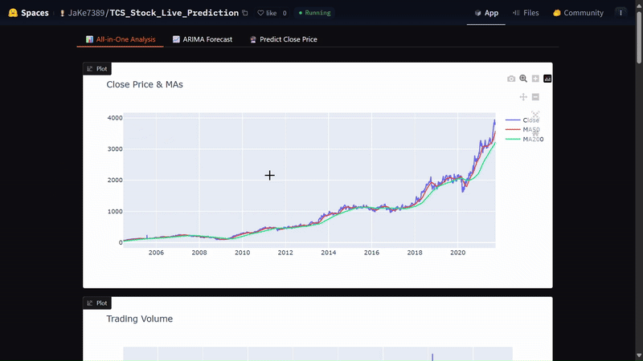

=====

## 📈 TCS Stock Price Prediction & Analysis App

An AI-powered Gradio web application for analyzing and forecasting TCS stock prices using multiple machine learning models, SHAP explainability, and PDF report generation.

## 🚀 Features

✅ **Model Comparisons and Forecasting**

- Linear Regression (scikit-learn)
- Random Forest (scikit-learn)
- XGBoost (xgboost)
- LSTM Forecasting (TensorFlow)
- ARIMA Forecasting (pmdarima)
- Plotly interactive visualizations
- Exportable PDF reports (matplotlib)

✅ **Explainable AI**

- SHAP waterfall plots for transparent prediction insights

✅ **Prediction Tab**

- Predict TCS closing price based on custom inputs
- Instant SHAP explainability output

✅ **Intuitive Gradio Interface**

- Multi-tab UI for streamlined access
- Interactive and responsive layout

---

## 🧠 Models Used

- **Linear Regression** – scikit-learn
- **Random Forest Regressor** – scikit-learn
- **XGBoost Regressor** – xgboost
- **LSTM** – TensorFlow/Keras
- **ARIMA** – pmdarima (auto_arima)

---

## 📦 Installation & Dependencies

Make sure to install dependencies using the pinned versions:

```bash
pip install -r requirements.txt
```

> ✅ Important: Use `numpy==1.24.4` to avoid compatibility issues with TensorFlow and joblib.

---

## 🗂️ Project Structure

```bash
TCS_Stock_Gradio_App/
├── app.py                       # Main Gradio app logic
├── lstm_model.py                # LSTM model training
├── train_rf_xgb.py              # Random Forest & XGBoost training
├── model/
│   ├── TCS_Stock_Predictor.pkl
│   ├── rf_model.pkl
│   ├── xgb_model.pkl
│   ├── tcs_lstm_model.keras
│   └── tcs_lstm_scaler.pkl
├── data/
│   ├── TCS_stock_history.csv
│   ├── TCS_stock_action.csv
│   └── TCS_stock_info.csv
├── predictions/
│   ├── tcs_stock_analysis.pdf
│   └── tcs_report.pdf
├── requirements.txt
├── README.md
└── .github/workflows/huggingface-deploy.yml
```

---

## 🖥️ Run Locally

```bash
# Activate virtual environment
.env\Scriptsctivate

# Launch the app
python app.py
```

Then open [http://localhost:7860](http://localhost:7860) in your browser.

---

## 📄 PDF Report

Generates a downloadable PDF report with:

- Price vs Moving Averages
- Volume
- Dividends & Splits
- Daily % Change Histogram
- Model Predictions (LR, RF, XGB)
- LSTM Forecast

---
---

## 🧪 Notes

- Ensure the correct numpy version (`1.24.4`) when saving/loading models.
- If errors occur with model loading (e.g., `numpy._core`), re-train and re-save using consistent versions.

---

## 📥 Run via Git

```bash
git clone https://github.com/Jayanth2323/TCS-Stock-Data-Live-Prediction
cd TCS-Stock-Data-Live-Prediction
pip install -r requirements.txt
python app.py
```

---

---

## 📸 Preview

> Add a GIF or screenshot demo here
> Example:
> 

---

## 📤 Deployment Suggestion

Deploy on:

- [Hugging Face Spaces](https://huggingface.co/spaces)
- [Streamlit Community Cloud](https://streamlit.io/cloud) (if converted)
- [Heroku](https://heroku.com) or [Render](https://render.com)

---

## 👨‍💻 Author

**Jayanth Chennoju**
🔗 [LinkedIn Profile](https://www.linkedin.com/in/jayanth-chennoju-5a738923k/)

---
